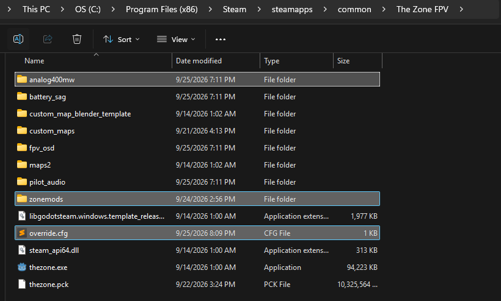
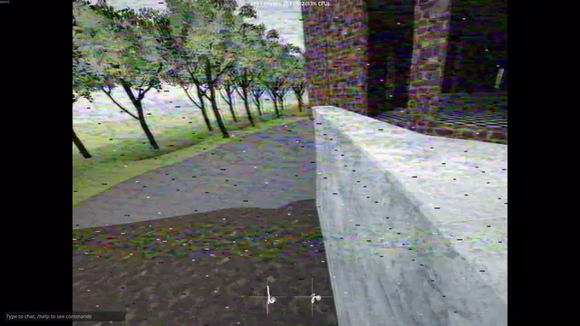

# How to use
- on the right, go to Releases and download the ZIP for the mod you want, as well as the mod loader "zonemods". Alternatively you can download the collection which has all the mods, and the mod loader.
- extract the ZIP to your game folder (steamapps\common\The Zone FPV\)

override.cfg, the zonemods folder, and the folder for the mods you want should all be next to the game .exe

Each mod has its own settings.cfg where they can be disabled individually, as well as many settings you can tweak.

## analog400mw
simulates 400mw analog signal quality

## battery_sag

Lets you define a virtual battery to a drone preset, batteries will drain during use based on throttle or idle amperage. Recommend to use with fpv_osd mod as it'll show your battery stats.

The default method to equip a fresh battery is to DISARM and RESET. This will also take into consideration if you move your spawn point with S. You can configure the fresh pack behavior in settings.cfg

## fpv_osd

OSD simulation, with features from Betaflight and BrainFPV. Replaces a few in-game UI elements and integrates them into OSD, like ARMED message, Turtle Mode/Crash flip, and gets rid of "press r to reset" message on ground touch. Custom crosshair support, horizon lines, custom layouts and font support, and more. Compatible with battery_sag mod to show battery life.

## pilot_audio

Causes audio to only be heard from the spawn position, with simulated doppler effect for fly-bys and allows for emulating multiplayer drone sounds. This can be kinda scary loading into a popular OG Bando and you may wanna fly somewhere else and change your spawn with S. Only simulates the closest 8 drones to you, you can change how many drones you can hear in the settings.cfg.

