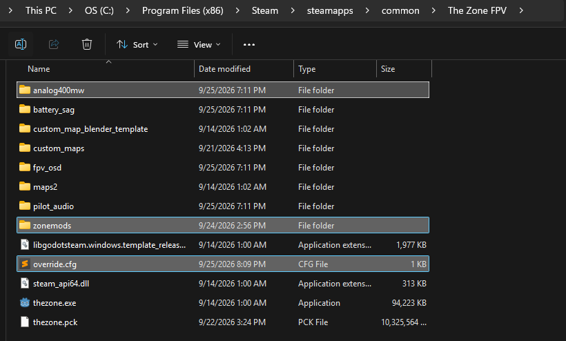
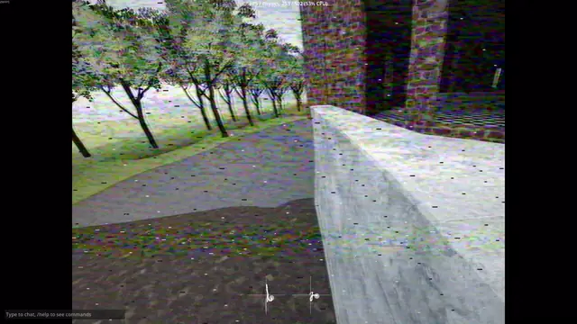
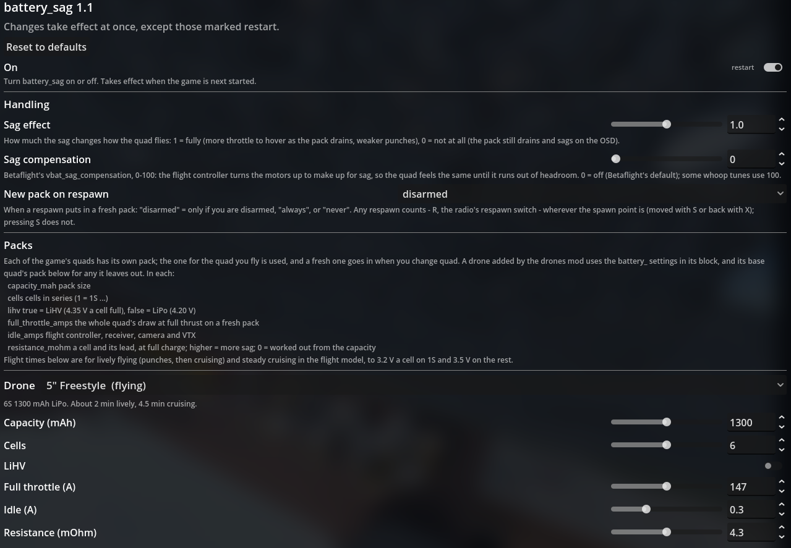
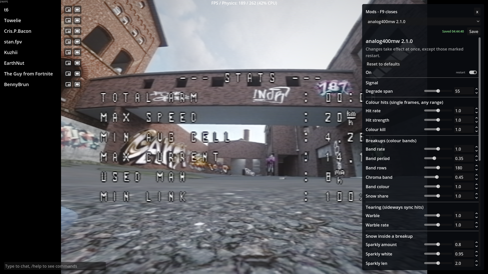
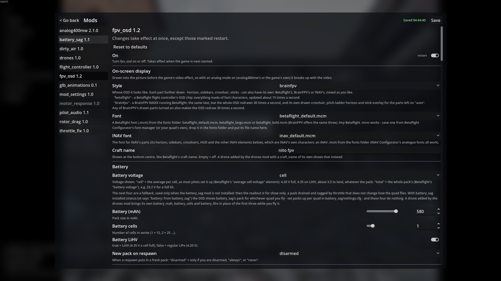
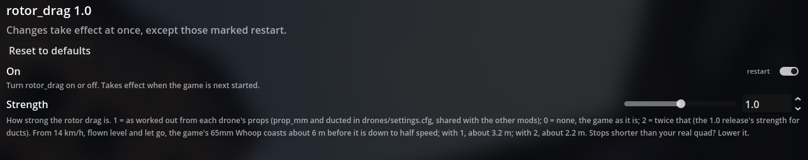
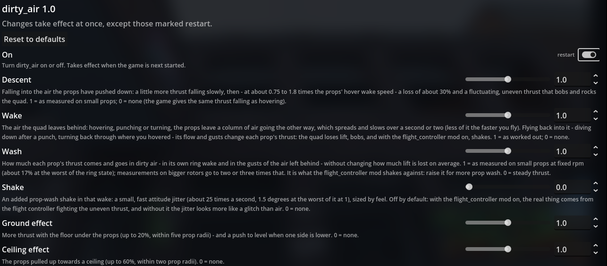

# How to use
- on the right, go to Releases and download the ZIP for the mod you want, as well as the mod loader "zonemods". Alternatively you can download the collection which has all the mods, and the mod loader.
- extract the ZIP to your game folder (steamapps\common\The Zone FPV\)

override.cfg, the zonemods folder, and the folder for the mods you want should all be next to the game .exe


Each mod has its own settings.cfg where they can be disabled individually, as well as many settings you can tweak.


## analog400mw
simulates 400mw analog signal quality



## battery_sag

Lets you define a virtual battery to a drone preset, batteries will drain during use based on throttle or idle amperage. Recommend to use with fpv_osd mod as it'll show your battery stats.

The default method to equip a fresh battery is to DISARM and RESET. This will also take into consideration if you move your spawn point with S. You can configure the fresh pack behavior in settings.cfg



## fpv_osd

OSD simulation, with features from Betaflight, BrainFPV, Quicksilver, and iNav. Replaces a few in-game UI elements and integrates them into OSD, like ARMED message, Turtle Mode/Crash flip, and gets rid of "press r to reset" message on ground touch. Custom crosshair support, horizon lines, custom layouts and font support, and more. Compatible with battery_sag mod to show battery life.

## pilot_audio

Causes audio to only be heard from the spawn position, with simulated doppler effect for fly-bys and allows for emulating multiplayer drone sounds. This can be kinda scary loading into a popular OG Bando and you may wanna fly somewhere else and change your spawn with S. Only simulates the closest 8 drones to you, you can change how many drones you can hear in the settings.cfg.

## throttle fix
Throttle Fix addresses the issue with the game initializing the throttle in the middle position until you move your throttle some amount.

What it does:
When your controller is initially connected, or reconnected, it will set your throttle to 0%. Since you have to be at 0 throttle to ARM the drone, your throttle will usually be all the way down. However, the game starts with 50% throttle, so you have to wiggle the gimbal to re-register what the true position is. This mod sets your throttle to 0 between your controller initialization and its first input.


How it works:
It works out which end is "down" from your controller setup, so an inverted throttle, custom end points or a centre offset are handled. 
If you reconnect the radio mid-session, it does this again.
A gamepad set up so the resting stick already means zero throttle is left alone.

## examples/glb_anim
Basic mod that plays and loops animations within a .glb file/map. It's an example mod, but it does allow for dynamic maps with moving parts and colliders.

## Mod settings

lets you edit settings in-game (adds a Mods button to pause menu, or overlay with F9 key by default)




## Rotor Drag

simulates rotor drag. Props draw air in and throw it out. Force grows with the speed itself.



## Drones

All drone settings that interface with other mods. Allows you to create custom Drone presets with their own name, weight, thrust, top speed, drag on each axis, rotation/turtle torque, camera angle/fov/fisheye, prop size, motor and motor sound, battery and OSD craft name

## Dirty Air 

Cause you to leave air behind, lasting a second or two and spreading. Floor gives more thrust under the props and ceiling pulls the props up.



## Flight controller

Each motor gets its own torque rather than them all getting idealized torque. Define Betaflight PIDs for motors, airmode option, and more

## zonemods

This is the mod loader that my other mods rely on.

The override.cfg tells the game to load the mod loader, which then loads the defined mods. By default, it loads every folder that has a zonemod.cfg file

```
; zonemods - loads mods for The Zone FPV. See zonemods/README.txt.
; Delete this file and the zonemods folder to start the game without mods.
[autoload]

ZoneMods="*res://zonemods/zonemods.gd"

[zonemods]

; Mod folders to load, in order, e.g. mods="analog400mw,another_mod".
; Empty = every folder next to thezone.exe that has a zonemod.cfg.
mods=""
```
